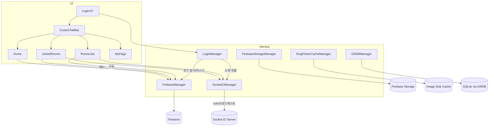

# OutPick 포트폴리오

## 1) 프로젝트 개요
- **프로젝트명**: OutPick
- **핵심 가치**: 날씨/취향 기반의 대화와 콘텐츠 공유를 빠르게 연결하는 실시간 경험 제공
- **핵심 기능**: 소셜 로그인(Google/Kakao) · 실시간 채팅(Socket.IO) · 이미지/비디오 업로드(Firebase Storage) · 캐시/오프라인 지원(Kingfisher/GRDB)

## 2) 아키텍처 개요
```
[UI Layer]
LoginVC ──▶ (LoginManager) ──▶ Initial Screen (Onboarding or Tab)

CustomTabBar
  ├─ Home(Weather)
  ├─ RoomLists
  ├─ JoinedRooms
  └─ MyPage

[Data/Service Layer]
FirebaseManager ── Firestore (프로필/룸/메시지 메타)
FirebaseStorageManager ── Storage (이미지/비디오)
SocketIOManager ── Socket.IO Server (실시간 메시지)
GRDBManager ── Local DB (오프라인/인덱스)
KingFisherCacheManager ── Image cache (메모리/디스크)

[Cross-cutting]
Alert/Banner/Keychain/Retry/Cache
```

### 선택 배경과 해결한 문제
- 인증/온보딩 지연 → `FirebaseAuth + GoogleSignIn + Kakao SDK`로 단일 플로우.
- 실시간 대화 신뢰성/네트워크 변동 → `Socket.IO` + ack + 옵티미스틱 UI.
- 이미지/비디오 업로드 비용/속도/메모리 → `Firebase Storage` + `Kingfisher` + 자체 비디오 디스크 캐시.
- 오프라인/느린 네트워크 → `GRDB` 로컬 인덱스 및 캐시 우선 전략.

### 2-1) 아키텍처 선택 이유
- **MVP 속도/팀 리소스**: 서버 구축 비용 절감과 빠른 검증을 위해 Firebase/Socket.IO 채택
- **실시간 신뢰성**: Socket.IO ack와 옵티미스틱 UI로 지연·중복·실패 흡수
- **미디어 친화성**: Storage 업로드 + 캐시 계층(Kingfisher/비디오 디스크 캐시)
- **오프라인 고려**: GRDB로 핵심 인덱스 로컬 보관, 재실행/오프라인에서도 최소 UI 유지

## 3) 폴더 구조 요약
```
OutPick/
  Controllers/  # 화면(ViewController) 레이어
  Models/       # 도메인/매니저(Firebase/Socket/GRDB/Cache 등)
  Views/        # UI 컴포넌트/셀/커스텀뷰
  Utility/      # Retry/Transitions/Support
```

### 3-1) 하위 폴더 상세
- `Controllers/Chat/`: 채팅 목록/검색/참여/설정 VC
- `Controllers/Login/`: 소셜 로그인/후처리 진입점
- `Controllers/Weather/`: 홈(날씨) 컬렉션 뷰
- `Controllers/TabBar/`: 커스텀 탭바 및 화면 전환
- `Models/DatabaseManager/`: Firestore/Storage 접근
- `Models/SocketManager/`: Socket.IO 클라이언트, 룸/메시지 구독
- `Models/GRDBManager/`: 로컬 DB 풀/마이그레이션/간단 모델
- `Models/KingFisherCacheManager/`: 이미지 캐시 유틸
- `Views/Chat/`: 메시지 셀/미디어 셀

## 4) 주요 컴포넌트 연결
- 로그인 성공 → `LoginManager.commonLogingProcess()`가 Firestore 리스너/Socket 연결/초기 화면 분기
- 채팅 진입 → `SocketIOManager.subscribeToMessages`로 스트림 구독, 이미지/비디오 메타 브로드캐스트
- 미디어 처리 → Storage 업로드 + Kingfisher/비디오 디스크 캐시
- 로컬 데이터 → `GRDBManager`로 사용자/룸 멤버/미디어 인덱스 관리

### 4-1) 컴포넌트 세부 역할
- `LoginManager`: 중복 로그인 탐지(디바이스 ID), 프로필 리스너, 초기 화면 분기
- `FirebaseManager`: 프로필/룸/핫룸/메시지 메타 리스닝 및 업데이트 API
- `FirebaseStorageManager`: 이미지/비디오 업로드, 재시도/메모리 제한 튜닝 포인트 제공
- `SocketIOManager`: 룸 조인/리스너/메시지 ack 처리, 옵티미스틱 UI, 미디어 메타 브로드캐스트
- `GRDBManager`: LocalUser/RoomMember/미디어 인덱스, 마이그레이션/인덱스 관리
- `KingFisherCacheManager`: 메모리/디스크 캐시 히트 우선, 동시 동일 키 요청 병합(in-flight dedupe)

## 5) 사용자 플로우
```
[앱 실행]
  │
  ▼
[로그인: Google/Kakao]
  │(성공)
  ▼
[신규: 프로필 설정 / 기존: 탭]
  │
  ▼
[탭: 홈/목록/참여중/마이]
  │
  ▼
[채팅방] ─ 실시간 메시지/이미지/비디오 공유
```

### 5-1) 화면별 목적/기능
- **로그인**: 소셜 로그인, 성공 시 초기 분기 수행
- **홈(날씨)**: 날씨/추천 데이터 리스트 시각화, 빠른 재방문 포인트
- **채팅 목록**: 핫룸/검색/참여, Combine 기반 실시간 리스트 갱신
- **참여중**: 참여 방 빠른 접근, 배너/리스너 연동
- **채팅방**: 텍스트·이미지·비디오 전송, ack 기반 실패 처리/재시도
- **마이페이지**: 프로필/설정/로그아웃

## 6) 화면별 설명
- 로그인: 소셜 로그인, 성공 시 초기 분기 수행
- 홈(날씨): 날씨/추천 데이터 리스트 시각화
- 채팅 목록: 핫룸/검색/참여, 실시간 업데이트
- 참여중: 참여 방 빠른 접근, 배너/리스너 연동
- 채팅방: 텍스트·이미지·비디오 전송, ack 기반 실패 처리/재시도
- 마이페이지: 프로필/설정/로그아웃

## 7) 외부 라이브러리/도구와 사용 방식
- Firebase(Auth/Firestore/Storage): 소셜 로그인, 프로필/룸/메시지 메타, 미디어 업로드
- GoogleSignIn, Kakao SDK: 멀티 소셜 로그인 통합
- Socket.IO: 룸 기반 실시간 메시지, ack, 중복/실패 제어
- Kingfisher: 이미지 캐시(메모리/디스크), 네트워크 최소화
- GRDB: 로컬 DB, 오프라인/빠른 재시작/인덱스 질의

## 8) 성능/확장/현실적 선택
- 성능: 옵티미스틱 UI, ack 처리, in-flight dedupe, 비디오 LRU-ish 캐시
- 확장: Firestore 컬렉션 확장, Socket.IO 룸 파티션/스케일아웃, CDN 프론팅
- 현실적 선택: 초기 리소스 제약에 맞춘 서버리스+표준 라이브러리 조합

## 9) 본인 역할 & 사용 도구
- 인증/초기 분기 설계/구현, 실시간 채팅 클라(ack/재시도), 미디어 파이프라인(Storage/캐시), 로컬 DB 스키마/마이그레이션(GRDB)
- 도구: Xcode, Firebase 콘솔, Node(Socket.IO), Swift/Combine, GRDB, Kingfisher

## 10) 다이어그램/스크린샷 자리표시
- diagrams/
  - architecture.drawio (또는 PNG)
  - user-flow.drawio (또는 PNG)
- screenshots/
  - login.png, home.png, chat-list.png, chat-room.png, mypage.png

---
문의/보완 요청은 이슈로 남겨주세요.

## 부록 A) Mermaid 다이어그램

### 아키텍처


### 사용자 플로우
```mermaid
flowchart LR
  A[앱 실행] --> B{로그인}
  B -->|Google/Kakao 성공| C[초기 분기]
  C -->|신규| D[프로필 설정]
  C -->|기존| E[커스텀 탭바]
  E --> F[홈(날씨)]
  E --> G[채팅 목록]
  E --> H[참여중]
  E --> I[마이페이지]
  G --> J{방 선택}
  J --> K[채팅방 입장]
  K --> L[실시간 메시지/이미지/비디오]
  L --> M{백그라운드/재실행}
  M -->|캐시/로컬DB| E
```